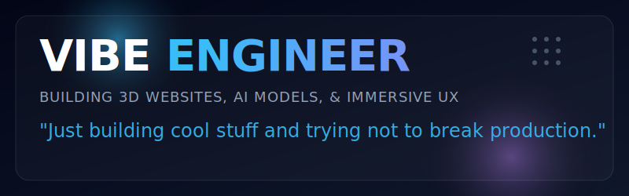
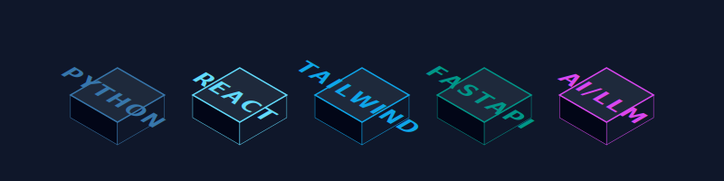
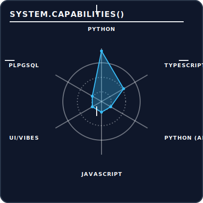

<!-- 
  PREMIUM HACKER PROFILE v4.3
  Layout: "The Origin Story" 
  Vibe: Dark Slate / Cyan Neon
-->

<!-- ========================================== -->
<!-- 1. THE HERO BANNERS                        -->
<!-- ========================================== -->
<picture>
  <source media="(prefers-color-scheme: dark)" srcset="./assets/hero-banner-dark.svg">
  <source media="(prefers-color-scheme: light)" srcset="./assets/hero-banner-dark.svg">
  
</picture>

 

<!-- Typing SVG -->

  

<!-- ========================================== -->
<!-- SOCIAL BADGES                              -->
<!-- ========================================== -->

  

<!-- ========================================== -->
<!-- 2. THE PERSONA                             -->
<!-- ========================================== -->

  Yo. I build 3D websites, chaotic full-stack apps, and train AI models in my room. 
  Just a 21yo figuring out how to make screens look cool and systems run fast.

  🔭 Currently building: <b>Next-Gen 3D Web Experiences</b> 
  🧠 Currently fighting: <b>CUDA out of memory errors</b> 
  🌱 Currently exploring: <b>RAG pipelines, WebGPU &amp; WASM</b> 
  ⚡ Fun fact: <b>Everything looks better in dark mode.</b>

 

<!-- Audio Feed (Sets the vibe for the scroll) -->
<!-- CASSETTE_LINK_START -->
<a href="./assets/audio/lag_ja_gale.mp3">
  <picture>
    <source media="(prefers-color-scheme: dark)" srcset="./assets/now_playing.svg">
    <source media="(prefers-color-scheme: light)" srcset="./assets/now_playing.svg">
    
  </picture>
</a>
 
<!-- NOW_PLAYING_TITLE_START -->Now Playing: Lag Ja Gale - Lata Mangeshkar<!-- NOW_PLAYING_TITLE_END -->
  

   

<!-- ========================================== -->
<!-- 3. THE ARSENAL                             -->
<!-- ========================================== -->
<h2>✦ Stack Loadout</h2>
<picture>
  <source media="(prefers-color-scheme: dark)" srcset="./assets/3d_stack.svg">
  <source media="(prefers-color-scheme: light)" srcset="./assets/3d_stack.svg">
  
</picture>
 

   

<!-- ========================================== -->
<!-- 4. THE GRIND (Side-by-Side)                -->
<!-- ========================================== -->
<table width="100%" align="center">
  <tr>
    <td align="center" width="50%">
      <h2>✦ System Telemetry</h2>
      <picture>
        <source media="(prefers-color-scheme: dark)" srcset="./assets/github_stats.svg">
        <source media="(prefers-color-scheme: light)" srcset="./assets/github_stats.svg">
        
      </picture>
    </td>
    <td align="center" width="50%">
      <h2>✦ System Capabilities</h2>
      <picture>
        <source media="(prefers-color-scheme: dark)" srcset="./assets/contribution_dashboard.svg">
        <source media="(prefers-color-scheme: light)" srcset="./assets/contribution_dashboard.svg">
        
      </picture>
    </td>
  </tr>
</table>

 

<!-- ========================================== -->
<!-- 4b. STREAK & TROPHIES                      -->
<!-- ========================================== -->

  

  

<!-- ========================================== -->
<!-- 5. DEEP SCAN (Side-by-Side)                -->
<!-- ========================================== -->
<table width="100%" align="center">
  <tr>
    <td align="center" width="50%">
      <h2>✦ Burn Rate Matrix</h2>
      <picture>
        <source media="(prefers-color-scheme: dark)" srcset="./assets/wakatime_heatmap.svg">
        <source media="(prefers-color-scheme: light)" srcset="./assets/wakatime_heatmap.svg">
        
      </picture>
    </td>
    <td align="center" width="50%">
      <h2>✦ Live Directives 🔴</h2>
      <picture>
        <source media="(prefers-color-scheme: dark)" srcset="./assets/crt_terminal_missions.svg">
        <source media="(prefers-color-scheme: light)" srcset="./assets/crt_terminal_missions.svg">
        
      </picture>
    </td>
  </tr>
</table>

   

<!-- ========================================== -->
<!-- 6. THE IMPACT                              -->
<!-- ========================================== -->
<h2>✦ The Pitch — Contribution Cricket 🏏</h2>

Every commit is a delivery. High-commit days light up as boundaries &amp; sixes.

<picture>
  <source media="(prefers-color-scheme: dark)" srcset="./assets/cricket_graph.svg">
  <source media="(prefers-color-scheme: light)" srcset="./assets/cricket_graph.svg">
  
</picture>
 

  <b>Score Legend:</b> &nbsp;
  🟦 1 commit = <b>W</b> (wide) &nbsp;|&nbsp;
  3+ = <b>1</b> &nbsp;|&nbsp;
  6+ = <b>2</b> &nbsp;|&nbsp;
  12+ = <b>4</b> (boundary) &nbsp;|&nbsp;
  20+ = <b>6</b> (six!) 🏏

  

<!-- ========================================== -->
<!-- 7. VISITOR COUNTER                         -->
<!-- ========================================== -->
 

  

<!-- ========================================== -->
<!-- 8. LET'S CONNECT                           -->
<!-- ========================================== -->
<h2>✦ Let's Connect</h2>

If you're building something cool — reach out. Always up for collabs, side-projects, or just talking tech.

  

<!-- ========================================== -->
<!-- 9. FOOTER                                  -->
<!-- ========================================== -->

