<!-- 
  PREMIUM HACKER PROFILE TEMPLATE 🚀
  Vibe: Cyberpunk / Sporty / "Samay Raina" Unhinged Engineer
-->

<!-- Hero Banner (Dynamic SVG Exploit) -->
<picture>
  <source media="(prefers-color-scheme: dark)" srcset="./assets/hero-banner-dark.svg">
  <source media="(prefers-color-scheme: light)" srcset="./assets/hero-banner-dark.svg">
  
</picture>

 

<!-- Typing SVG Hack for Subheadline -->

 

<!-- Invisible Alignment Table Hack for Layout -->
<table width="100%" border="0" cellpadding="0" cellspacing="0">
  <tr>
    <td width="55%" valign="top">
      <h2>✦ The Vibe</h2>
      

        Yo. I build 3D websites, chaotic full-stack apps, and train AI models in my room. Just a 21yo figuring out how to make screens look cool and systems run fast. 
      

      <ul>
        <li>🔭 Currently building: <b>Next-Gen 3D Web Experiences</b></li>
        <li>🧠 Currently fighting: <b>CUDA out of memory errors</b></li>
        <li>⚡ Unsolicited opinion: <b>Everything looks better in dark mode.</b></li>
      </ul>
       
      <h2>✦ The Tech Stack (Arsenal)</h2>
      <!-- Glassmorphism Custom Badges -->
      
      
      
      
    </td>
    <td width="45%" valign="top" align="center">
      <!-- DYNAMIC MISSION CONTROL (CRT TERMINAL THEME) -->
      <h3>Live Mission Control 🔴</h3>
      <picture>
        <!-- This SVG is auto-generated by our Python Github Action ! -->
        <source media="(prefers-color-scheme: dark)" srcset="./assets/crt_terminal_missions.svg">
        <source media="(prefers-color-scheme: light)" srcset="./assets/crt_terminal_missions.svg">
        
      </picture>
    </td>
  </tr>
</table>

 

<table width="100%" border="0" cellpadding="0" cellspacing="0">
  <tr>
    <td width="55%" valign="top">
      <h2>✦ The Essentials</h2>
      
<b>Backend & AI:</b> Python, PyTorch, LangChain, LangGraph, FastAPI

      
<b>Frontend & 3D:</b> React, Next.js, Three.js, R3F, Spline, TailwindCSS

      
<b>Focus:</b> Full-stack web development, vibe engineering, and shipping production-ready AI products.

       
      
📫 Reach me: <a href="mailto:your.email@example.com">Email</a> • <a href="#">LinkedIn</a> • <a href="#">Portfolio</a>

    </td>
    <td width="45%" valign="top" align="center">
      <!-- DYNAMIC STATS DASHBOARD / TECH RADAR -->
      <picture>
        <source media="(prefers-color-scheme: dark)" srcset="./assets/contribution_dashboard.svg">
        <source media="(prefers-color-scheme: light)" srcset="./assets/contribution_dashboard.svg">
        
      </picture>
    </td>
  </tr>
</table>

 

<table width="100%" border="0" cellpadding="0" cellspacing="0">
  <tr>
    <td width="50%" valign="top" align="center">
      <h2>✦ Audio Feed</h2>
      <!-- DYNAMIC HARMONY MUSIC SCROBBLER -->
      <a href="https://www.last.fm/user/YOUR_LASTFM_USERNAME">
        <picture>
          <source media="(prefers-color-scheme: dark)" srcset="./assets/now_playing.svg">
          <source media="(prefers-color-scheme: light)" srcset="./assets/now_playing.svg">
          
        </picture>
      </a>
    </td>
    <td width="50%" valign="top" align="center">
      <h2>✦ Neural Dump</h2>
      <!-- DYNAMIC OS SYSTEM ALERT -->
      <picture>
        <source media="(prefers-color-scheme: dark)" srcset="./assets/system_alert.svg">
        <source media="(prefers-color-scheme: light)" srcset="./assets/system_alert.svg">
        
      </picture>
    </td>
  </tr>
</table>

 

  <h2>✦ Telemetry: Live Training Loss</h2>
  
Currently fine-tuning LLaMA-3 locally. This graph updates dynamically via cron job.

  <picture>
    <source media="(prefers-color-scheme: dark)" srcset="./assets/loss_curve.svg">
    <source media="(prefers-color-scheme: light)" srcset="./assets/loss_curve.svg">
    
  </picture>

 

  <h2>✦ The Pitch (Live Cricket Contributions)</h2>
  <!-- Neon Cricket Contribution Game SVG -->
  <picture>
    <source media="(prefers-color-scheme: dark)" srcset="./assets/cricket_graph.svg">
    <source media="(prefers-color-scheme: light)" srcset="./assets/cricket_graph.svg">
    
  </picture>

