

<picture>
  <source media="(prefers-color-scheme: dark)" srcset="./assets/chalk-hero.svg">
  <source media="(prefers-color-scheme: light)" srcset="./assets/chalk-hero.svg">
  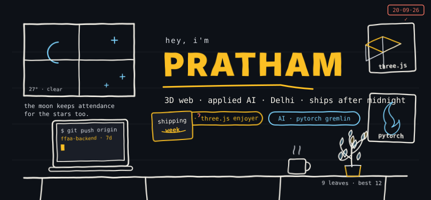
</picture>

 

<picture>
  <source media="(prefers-color-scheme: dark)" srcset="./assets/chalk-notes.svg">
  <source media="(prefers-color-scheme: light)" srcset="./assets/chalk-notes.svg">
  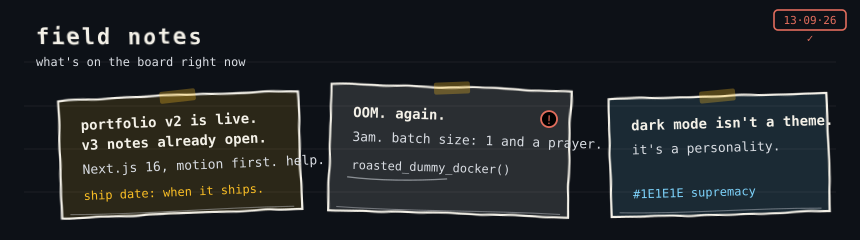
</picture>

<table width="100%">
  <tr>
    <td width="50%" align="center">

<a href="https://github.com/iAMv1/defenestrate">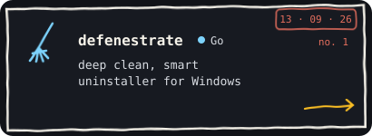</a>

</td>
    <td width="50%" align="center">

<a href="https://github.com/iAMv1/motionforge">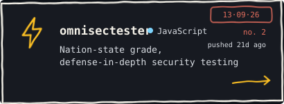</a>

</td>
  </tr>
  <tr>
    <td width="50%" align="center">

<a href="https://github.com/iAMv1/mindpulse">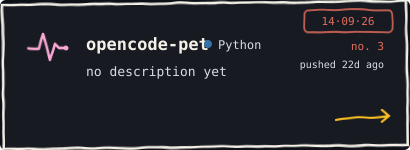</a>

</td>
    <td width="50%" align="center">

<a href="https://github.com/iAMv1/omnisectester">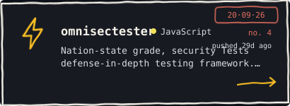</a>

</td>
  </tr>
</table>

<picture>
  <source media="(prefers-color-scheme: dark)" srcset="./assets/chalk-stack.svg">
  <source media="(prefers-color-scheme: light)" srcset="./assets/chalk-stack.svg">
  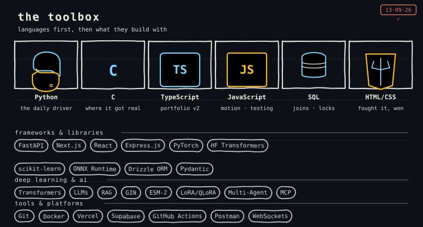
</picture>

<picture>
  <source media="(prefers-color-scheme: dark)" srcset="./assets/chalk-now.svg">
  <source media="(prefers-color-scheme: light)" srcset="./assets/chalk-now.svg">
  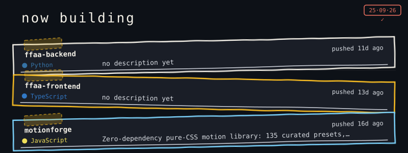
</picture>

<picture>
  <source media="(prefers-color-scheme: dark)" srcset="./assets/chalk-ledger.svg">
  <source media="(prefers-color-scheme: light)" srcset="./assets/chalk-ledger.svg">
  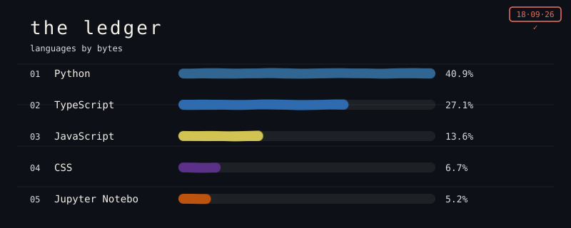
</picture>

<picture>
  <source media="(prefers-color-scheme: dark)" srcset="./assets/chalk-journey.svg">
  <source media="(prefers-color-scheme: light)" srcset="./assets/chalk-journey.svg">
  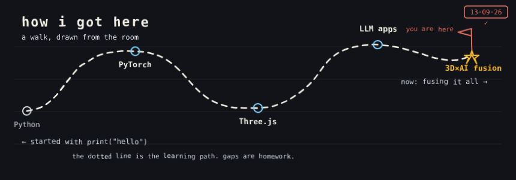
</picture>

<picture>
  <source media="(prefers-color-scheme: dark)" srcset="./assets/chalk-cricket.svg">
  <source media="(prefers-color-scheme: light)" srcset="./assets/chalk-cricket.svg">
  
</picture>

<picture>
  <source media="(prefers-color-scheme: dark)" srcset="./assets/chalk-music.svg">
  <source media="(prefers-color-scheme: light)" srcset="./assets/chalk-music.svg">
  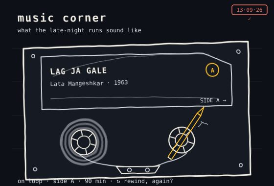
</picture>

<picture>
  <source media="(prefers-color-scheme: dark)" srcset="./assets/chalk-hi.svg">
  <source media="(prefers-color-scheme: light)" srcset="./assets/chalk-hi.svg">
  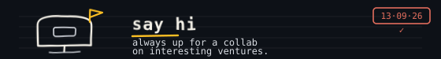
</picture>

<table width="100%">
  <tr>
    <td width="25%" align="center">

<a href="https://github.com/iAMv1">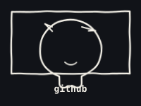</a>

</td>
    <td width="25%" align="center">

<a href="https://itzpratham.in">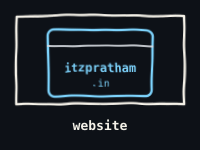</a>

</td>
    <td width="25%" align="center">

<a href="https://www.linkedin.com/in/itzpratham">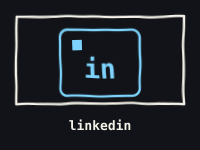</a>

</td>
    <td width="25%" align="center">

<a href="mailto:iam1nahata@gmail.com">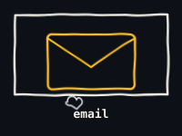</a>

</td>
  </tr>
</table>

